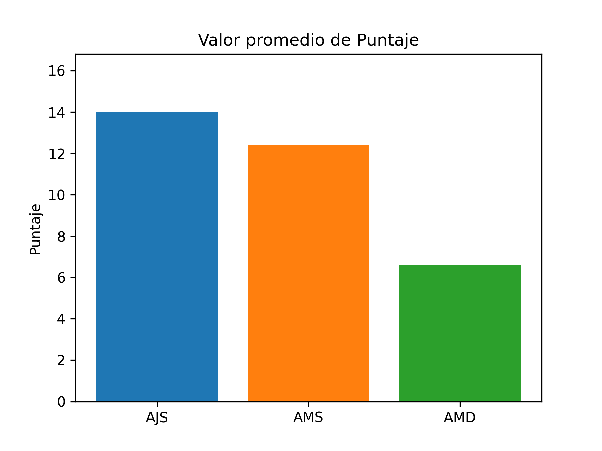
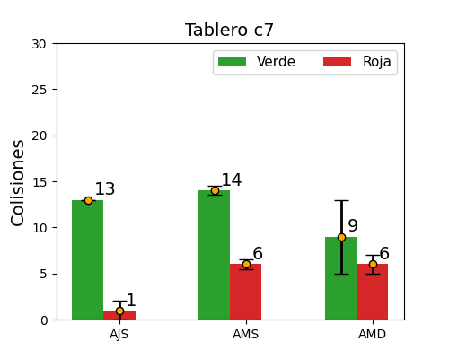
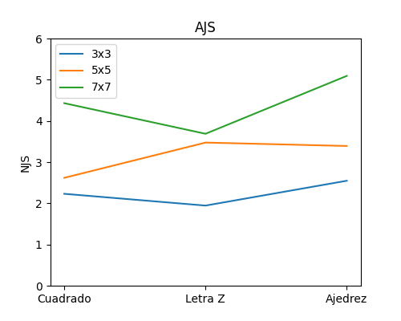
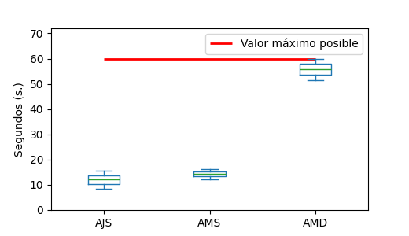
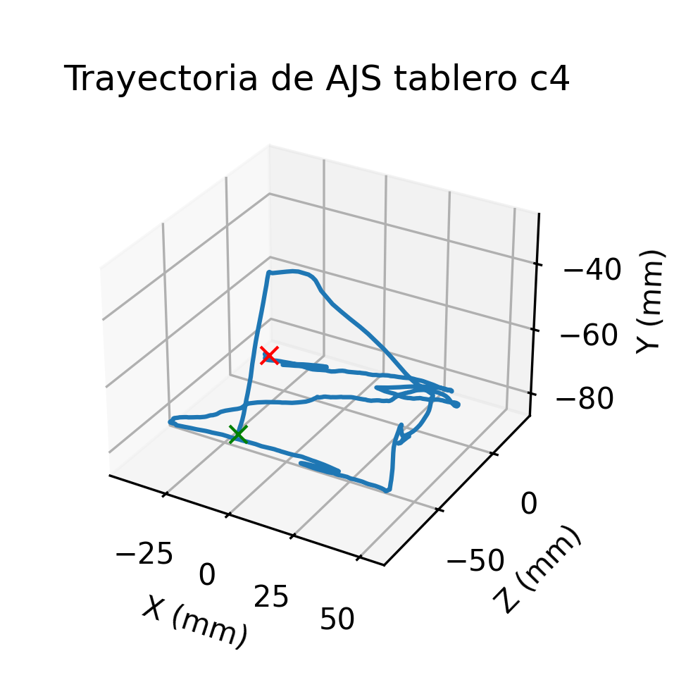
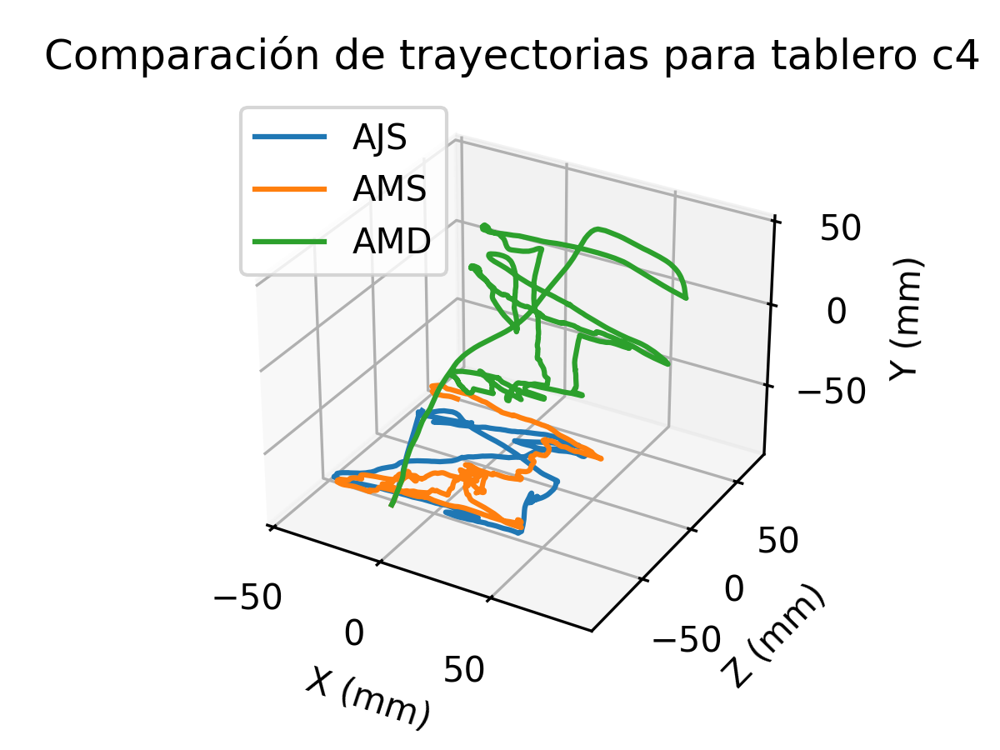

# Description of repository content

This repository has the code for generating the graphs of the project
"Serious game with haptic interaction for evaluating cognitive impairment in 
older people", the document of the project (in spanish) can be consulted 
in [this link](https://tesiunamdocumentos.dgb.unam.mx/ptd2025/jul_sep/0875815/Index.html).

This repository has the following elements:

1. **GithubData.zip**: Contains the data for each person who played the video game. 
This data was saved using Unity.

2. **Scripts**: Contains the Python scripts for generating the graphs.

3. **FigureExamples**: Examples of the generated graphs. Only a few of the 
total number of figures that can be generated is included.

## Description of the data 

The data is organized into folders, associated with the name of each person who tested the video game. 
The names of the people were encrypted to protect their identity using the sha256 function with Python.

Each person belongs to one of the following groups:

1. Healthy Young Adult (AJS).
2. Healthy Older Adult (AMS).
3. Older Adult with cognitive impairment (AMD).

Each person's folder contains the following elements:

1. *Positions* folder.
2. *Collisions* folder.
3. *ExperimentResults.csv* file.
4. *Information.json* file.

### Positions Folder

#### Overview
This folder contains .csv files to store the user's position (*Boardci.csv*) and 
speed (VelocityBoardci.csv) information for each board, where ci is the 
board label (from c0 to c11).

#### Position Files
The position is stored in files of the format *Boardci.csv*. This file contains 
6 columns: **sample**, stores the sample number being taken; **t**, measures the 
time (in seconds) from the start to the end of the trajectory; **x, y, z** measure the 
position of the stylus tip with which the user interacts (in millimeters) relative 
to the origin of the robot's coordinate system; and **HasCollision** indicates whether a 
collision occurred at position **x, y, z** (either with the green or red ball).

#### Files for Velocity
Velocity is stored in files of the format *VelocityBoardci.csv*.
This file contains 5 columns: **sample** stores the sample number being taken;
**t** measures the time (in seconds) from the start to the end of the trajectory; 
**vx, vy, vz** measure the velocity of the stylus tip with which the user 
interacts (in millimeters/second) relative to the origin of the robot's coordinate system.

### Collisions Folder

#### Overview
This folder contains .csv files to store information about the collisions 
the users had on each board (from c0 to c11).

### Files for Collision
Collisions are stored in files of the format *Boardci.csv*, where ci is the 
label of the board (from c0 to c11). This file contains 4 columns: 
**Collision k**, counts the collision number; **Collision time**, indicates 
the time the collision occurred (in seconds) from the start of the board sequence;
**Ball Position**, indicates the position of the ball (in the two-dimensional 
representation of the array) in which the collision occurred; **Ball Color**, 
indicates the color of the ball with which the collision occurred (Green or Red).

#### Files for the collision sequence
The collision sequence is stored in files of the format *SequenceCollisionsci.csv*,
where ci is the board label (from c0 to c11). This file contains 12 columns.

##### Columns 1 to 6
For columns 1 to 6: **Col. k**, indicates the collision number; **Type Ball k**,
indicates the type of ball k that the user collided with; **Pos. Ball k**, indicates the 
position of ball k that user collided with; **Time until collision k + 1**, indicates 
how much time passed between the collision of the user with ball k and the 
collision of the user with ball k+1; **Type Ball k+1**, indicates the type of ball 
k+1 that collided with; **Pos. Ball k**, indicates the position of ball k+1 that collided with.

##### Columns 7 to 12
For columns 7 to 12 contain metrics of the trajectory for the collision of the 
user from ball k to ball k+1: **NJS** indicates the smoothness by normalized jerk; 
**ArcLengthRatio** indicates the ratio between the arc length of the trajectory 
followed by the user and the length of a straight-line path connecting ball k to 
ball k+1; **Avg. Speed** indicates the average speed; **Std. Dev. Speed** 
indicates the standard deviation of the speed; **Avg. Acce** indicates the average acceleration; 
**Std. Dev. Acce** indicates the standard deviation of the acceleration.

### ExperimentResults.csv File
This file contains a summary of each person's results after completing the 
12-board sequence. This file contains 13 columns: columns 1 to 8 contain 
general information about the board sequence; Columns 9 through 13 contain 
information about the trajectory metrics from the beginning of the board 
until its completion.

#### Columns 1 through 8
For columns 1 through 8: **CompletedOrder** indicates the position in the board 
sequence; **Identifier** indicates the label used to identify the board; **Figure** 
indicates the shape of the board; **SizeBoard**, indicates the size of the 
board (1: 3x3, 2: 5x5, 3: 7x7); **BallSeparation**, indicates the distance between 
the centers of the balls in the video game; **BallSize**, indicates the size of 
the ball in the video game; **Score**, indicates the score obtained when completing the board; **CompletedTime**, indicates the time taken to complete the board.

#### Columns 9 to 13
Columns 9 to 13 are metrics of the trajectory followed by the user from the start 
of the board until its completion: **NJS**, indicates the smoothness by 
normalized jerk; **Avg. Speed**, indicates the average speed; **StdDevSpeed**, 
indicates the standard deviation of the speed; **Avg. Acc**, indicates the 
average acceleration; **StdDevAcce** indicates the standard deviation of the acceleration.

### Information.json File
This file was created to store the personal information of each user who played the 
video game. It contains the following elements:

- Name: To store the person's name.
- Age: To store the person's age.
- Gender: To store the person's gender.
- Condition: To store the person's condition. AJS: Healthy Young Adult, AMS: Healthy Older Adult, and AMD: Older Adult with cognitive impairment.

# Code Execution

## Before Execution
The code was written using Python version 3.11.8 with the following libraries:

1. Matplotlib. Version 3.8.4.
2. Numpy. Version 1.26.4.
3. Pandas. Version 2.2.2.

## Execution

To generate the graphs, follow these steps:

1. Clone the repository to the desired folder.
2. Unzip the "GithubData.zip" folder.
3. Run "generate_all_graphs.py ../GithubData png" to generate the graphs.

In step 3, "../GithubData" is the location of the data to be graphed, and "png" is the file extension for the images.

## After execution
Six folders and four .csv files will have been created in the scripts folder.

### Folders
These folders contain the resulting images for each graph.

#### AverageMetrics
Contains bar graphs of the average of the four metrics for the entire dataset.

##### Example Chart

#### Bar Charts
Contains bar charts of the average number of collisions per group with each board.

##### Example Chart

#### EffectDynamicParameters
Contains line graphs of the effect that board size and shape have on the four metrics per person group.

##### Example Graph

#### MetricsResponse
Contains box plots showing the effect of board size and shape on the four metrics for each person group.

#### Example Graph

#### Position Figures
Contains three-dimensional graphs of the path followed by a person from the AJS group on board c4.

##### Example Graph

#### Multiple Trajectories Figures
Contains three-dimensional graphs comparing the trajectory followed by a person from the AMS, AMD, and AJS groups on the c4 board.

##### Example Graph

### Files
The .csv files group the experiment results for each person (files "ExperimentResults.csv") by group (AJS, AMS, AMD) and for all people ("AllExperimentResults.csv").

These files can be used later for statistical analysis of the entire dataset and by group.